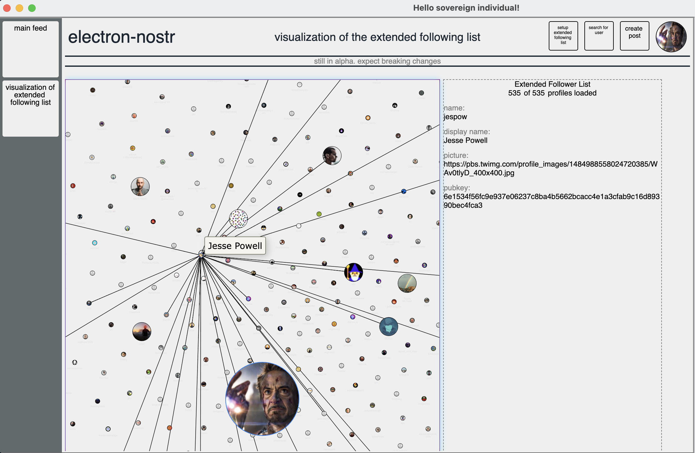

As of early 2023, this project has been forked and moved to [Pretty Good Apps](https://github.com/wds/pretty-good). See also this repo: [Decentralized Curation of Simple Lists](https://github.com/wds4/DCoSL), which specifies the protocol for decentralized reputation that is implemented in the Pretty Good Apps client.

<hr />

Boilerplate nostr desktop client using electron, react, sqlite3, and electron-builder. [electron-react-boilerplate](https://github.com/electron-react-boilerplate/electron-react-boilerplate) is my starting point, to which I have added [nostr-tools](https://github.com/fiatjaf/nostr-tools) and [nostr-react](https://github.com/t4t5/nostr-react), as well as [sqlite3](https://github.com/TryGhost/node-sqlite3).

Once this project has progressed far enough, I plan to incorporate a system of decentralized reputation, two projects that I call the Grapevine and the Concept Graph. I have some very thoroughly fleshed out ideas on how to do this.

However, I think a lot of people have a lot of different ideas on how to build decentralized ratings, reputation, and web of trust. In my mind, we haven't yet figured out how to do this right, and this is perhaps the greatest unsolved problem in this space. Therefore, I also plan to maintain the electron-nostr boilerpate as a template minus my own proposed solutions (the Grapevine and the Concept Graph). My hope is that the electron-nostr template will be a useful tool for a wide range of people who want to play around with their own ideas on how to build a web of trust. If you have ideas you want to try out and you know css, html, and javascript, hopefully your learning curve (basics of git, react, sqlite3) will be as painless as possible. The more ideas we can try, the better for us all!

I have been using [vis.js](https://visjs.org) tools (currently: [vis-data](https://github.com/visjs/vis-data) and [vis-network](https://github.com/visjs/vis-network)) to visualize the Grapevine web of trust, so I may include these in the electron-nostr boilerplate as well as any other tools that I think may be generically useful for others in their experimentation. Support for IPFS and [gun](https://github.com/amark/gun) come to mind.

Let me know if you would like to use and/or contribute to the basic electron-nostr template. If there is enough interest, I may be able to secure a small amount of funding to support its development and maintenance.

## Features

Currently, this app works in dev mode. The mac release (v0.1.x-alpha) also is functional. linux and windows releases are not yet functional.

- automatic generation of privkey and pubkey
- abiliity to import privkey and pubkey
- view and manage basics of your profile (name, picture_url, etc)
- support for multiple profiles
- main feed in 3 modes: "following" (your follows), "Extended following" (+ their follows) and "firehose" (completely unfiltered)
- view other profiles
- follow / unfollow button
- submit a post
- reply to a post
- thread viewer (very basic implementation)
- youtube video playback
- extended
- graphical visualization of extended following list using vis.js (in v0.2.0-alpha release)



## Todo

- direct messaging
- refactor thread viewer
- refactor following page (need to request events for info on all users at once, not separate request for each user)
- add retweet, like buttons
- add notifications
- show pictures in posts
- implement caching (redux?)
- calculate and show number of followers
- maybe change location of sql database
- lightning invoice support
- back button
- bookmark events
- pin events
- support for multiple accounts
- support for multithreading (multiple electron rendering processes) using the same techniques of [this template](https://github.com/wds4/electron-react-boilerplate-multiple-windows)

## Known issues

- Websockets sometimes do not reconnect after being dropped
- Follow buttons sometimes do not show change in follow status (or are slow to reflect change)
- v0.1.x-alpha linux build so far does not function - problem with sqlite3 I think

## Install

Clone the repo, install dependencies, make sql directory:

```bash
git clone https://github.com/wds4/electron-react-boilerplate-nostr.git your-project-name
cd your-project-name
npm install
cd release/app
mkdir sql
cd ../..
```

## Starting Development

Start the app in the `dev` environment:

```bash
npm start
```

## Packaging for Production

To package apps for the local platform:

```bash
npm run package
```
To package for other platforms, see [these instructions](https://electron-react-boilerplate.js.org/docs/packaging).

## License

MIT © [Electron React Boilerplate](https://github.com/electron-react-boilerplate)
